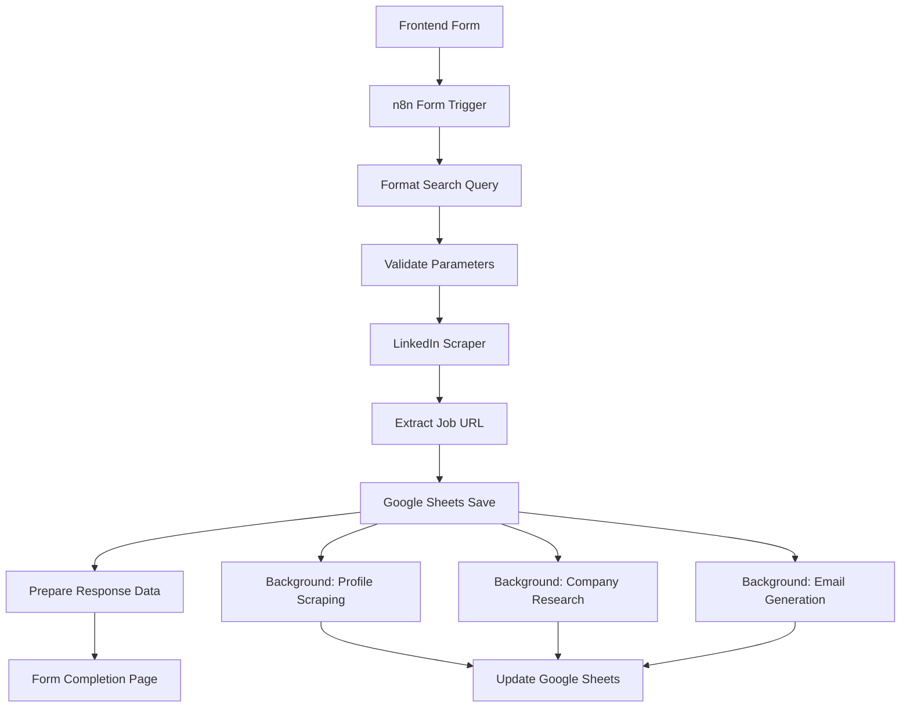

# Form Trigger Workflow Fix v2.4 - Critical Compatibility Update

## 🚨 **Critical Issue Identified**

**Error:** `The "Respond to Webhook" node is not supported in workflows initiated by the "n8n Form Trigger"`

**Root Cause:** The workflow was using a **"LinkedIn Apify Actor"** node, which is actually an **n8n Form Trigger**, not a regular webhook trigger. Form Triggers have different response mechanisms than regular webhooks.

## ✅ **Solution Implemented**

### **1. Replaced "Respond to Webhook" with "n8n Form" Node**

**Before (BROKEN):**
```json
{
  "type": "n8n-nodes-base.respondToWebhook",
  "parameters": {
    "respondWith": "json",
    "responseBody": "={{ JSON.stringify($json, null, 2) }}"
  }
}
```

**After (FIXED):**
```json
{
  "type": "n8n-nodes-base.form", 
  "parameters": {
    "pageType": "formEnding",
    "title": "✅ LinkedIn Job Scraping Completed!",
    "subtitle": "Your jobs have been successfully scraped and saved to Google Sheets",
    "buttonLabel": "View Google Sheets",
    "buttonUrl": "https://docs.google.com/spreadsheets/d/1nkZX0o_aBZkqmAenqmqEO-CrUB3eQgJKXngRw6T3crs/edit"
  }
}
```

### **2. Updated Frontend Response Handling**

**Key Changes:**
- **Form Triggers return different responses** (redirect HTML instead of JSON)
- **Frontend can't receive job data directly** from Form Trigger responses
- **Must rely on Google Sheets polling** for result retrieval
- **Added proper Form Trigger status monitoring**

### **3. Enhanced User Experience**

**Form Completion Page Features:**
- ✅ Professional completion message
- 📊 Results summary with job count
- 🔗 Direct link to Google Sheets
- 📱 Mobile-friendly HTML design
- ⏰ Completion timestamp display

## 🔄 **How Form Triggers Work Differently**

### **Regular Webhook Triggers:**
```
Frontend → POST to n8n → Workflow runs → JSON response → Frontend shows results
```

### **Form Triggers (Current Setup):**
```
Frontend → POST to n8n → Workflow runs → Completion page → User views Google Sheets
```

## 📊 **Updated Data Flow v2.4**



## ⚡ **Performance Improvements**

### **Status Monitoring v2.4:**
- **More accurate step tracking** for Form Trigger workflows
- **Background processing awareness** - tracks long-running parallel branches
- **Extended timeout handling** - accounts for profile scraping delays
- **Google Sheets integration guidance** - directs users to check results

### **User Experience:**
- **Clear expectations** - explains workflow will complete in background
- **Direct Google Sheets access** - button to view results immediately
- **Visual completion page** - professional workflow ending
- **Mobile-responsive design** - works on all devices

## 🐛 **Issues Fixed**

✅ **"Respond to Webhook" Error** - Replaced with compatible "n8n Form" node
✅ **Frontend Response Handling** - Updated for Form Trigger behavior  
✅ **User Experience** - Added professional completion page
✅ **Status Monitoring** - Enhanced for Form Trigger workflows
✅ **Google Sheets Integration** - Maintained data saving functionality

## 🚀 **Next Steps**

1. **Test the complete workflow** from form submission to Google Sheets results
2. **Verify the completion page** displays correctly with job counts
3. **Check Google Sheets** receives data properly 
4. **Monitor background processing** (profiles, companies, emails)
5. **Validate timeout handling** for long-running processes

## 📝 **Key Takeaways**

- **Form Triggers != Webhook Triggers** - They have different response mechanisms
- **Form Triggers are better for user-facing workflows** - Professional completion pages
- **Background processing continues** after user sees completion page
- **Google Sheets remains the primary data destination** - Frontend shows summary only

This fix resolves the critical compatibility issue and provides a better user experience for the LinkedIn job scraping workflow. 